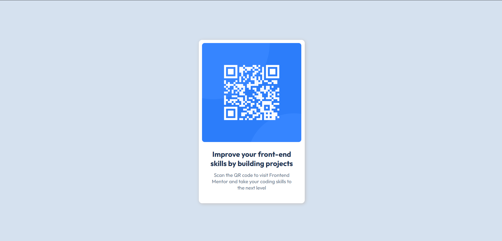

# Frontend Mentor - QR code component solution

This is a solution to the [QR code component challenge on Frontend Mentor](https://www.frontendmentor.io/challenges/qr-code-component-iux_sIO_H). Frontend Mentor challenges help you improve your coding skills by building realistic projects. 

## Table of contents

- [Overview](#overview)
  - [Screenshot](#screenshot)
  - [Links](#links)
- [My process](#my-process)
  - [Built with](#built-with)
  - [What I learned](#what-i-learned)
  - [Continued development](#continued-development)
- [Author](#author)

## Overview

I created a QR Code Component design as part of a Frontend Mentor challenge. The project is built using HTML, CSS, and Flexbox to achieve a clean, responsive layout.

### Screenshot

### Links

- Live Site URL: [Add live site URL here](https://your-live-site-url.com)

## My process

### Built with

-Semantic HTML5 markup
-CSS custom properties
-Flexbox for layout

### What I learned

I practiced structuring a simple card component, improved my CSS styling skills, and gained more confidence in using Flexbox for alignment.

### Continued development

I plan to continue improving my responsive design skills and explore more advanced layouts with Grid and modern CSS features.

## Author

- Website - [Add your name here](https://www.your-site.com)
- Frontend Mentor - [@MuskiiSK06](https://www.frontendmentor.io/profile/MuskiiSK06)
